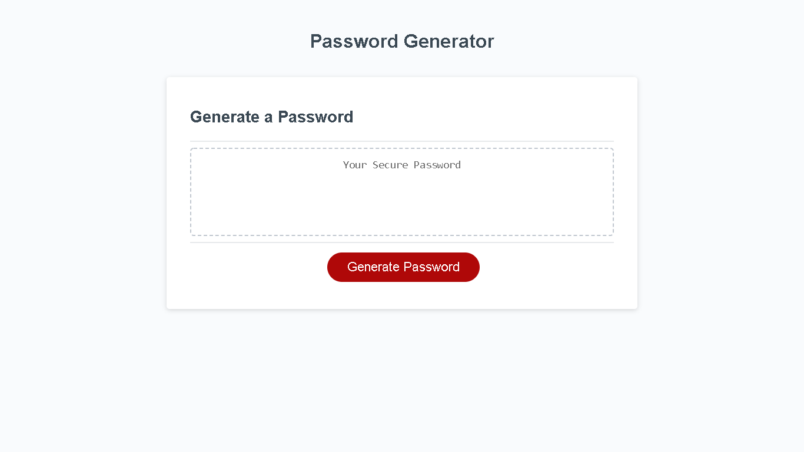

# Password-generator
## <h2>Description</h2>

 In this proyect, you'll see how much i learned from javascript. I know you'll find some bugs and definitly some mistakes. But this is my first time doing a proyect with javascript. Knowing that, today I'm showing this password generator with random characters.

 <li>
            <a href="#Password-generator">Password generator</a>
             </li>
            <li>
                <a href="#Future">Future Update</a>
            </li>
             <li>
                 <a href="#contact">Contact</a>
             </li>
           

## <h2 id="Password-generator"><i> Password generator</i></h2>
 
 
 With this password generator, you'll be able to create random paswords that includes: <strong>Simbols, Numbers, Uppercase and Lowercase characters.</strong> Also you'll be able to choose the quantity of characters, if you want or not any special character. 

 </a>

 ## <h2 id="Future"><i> Future Update</i></h2>
 
 As you might see, it has some mistakes that I plan to fix while i'm getting more experience. If you want to try it, just click <a href=" " target="_blank">here

 ## <h2 id="contact"><i>Contact information</i></h2>

 As always, you'll find 3 ways to contact me:

    <li><a href="https://www.facebook.com/elrubiuhs" target="_blank">My facebook</a></li>
    <li><a href="https://github.com/bruno192000" target="_blank">Github</a></li>
    <li>My phone number: 6146959922</li>
